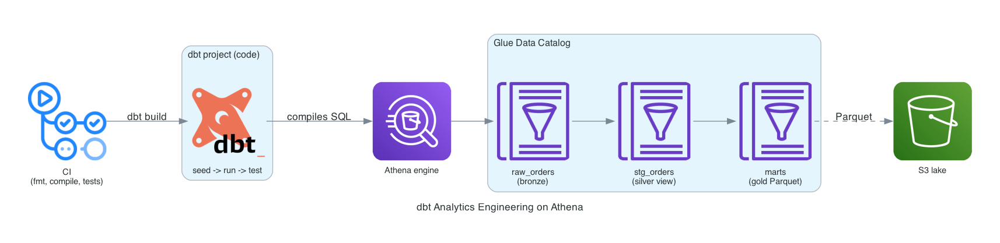

# dbt Analytics Engineering on Athena

The analytics-engineering layer on top of a serverless lake: the transformations
are code, and one command reconciles the warehouse to them. A dbt project on the
dbt-athena adapter seeds raw orders, builds a typed and cleaned silver staging
view, and materializes two gold marts as Snappy Parquet, with twelve data tests
gating every run. Terraform provisions the S3 lake, the Glue schema dbt
materializes into, and the Athena workgroup; CI compiles the model DAG on every
push.



## Cost and teardown risk, up front

Built to deploy, demo, and destroy. There is no always-on compute:

- S3, Glue Data Catalog: pennies for a 5k-row seed.
- Athena: $5/TB scanned. The whole `dbt build` scans a few MB, so effectively free.
- No warehouse endpoint, no cluster, no NAT. Nothing accrues while idle.

A full deploy-demo-destroy session runs well under $0.25. `terraform destroy`
empties the bucket (`force_destroy = true`) and removes the Glue schema and
workgroup, so nothing lingers.

## Bronze, silver, gold

- **Bronze** is the `raw_orders` dbt seed loaded into the catalog as-is.
- **Silver** (`stg_orders`) is a view that types and cleans bronze: `order_date`
  cast to a real date, rows with non-positive quantity or price dropped, and a
  computed `line_total` the marts can trust.
- **Gold** is two Parquet marts a dashboard reads directly: `category_revenue`
  (revenue and counts by category and country) and `daily_revenue` (one row per
  day with average order value).

Staging is a cheap view over raw; marts are materialized as Snappy Parquet so
downstream queries scan compressed columnar data instead of re-reading the seed.

## Data quality as a gate

Twelve dbt tests run on every `dbt build` and fail the run if the data drifts:

- `unique` and `not_null` on `stg_orders.order_id` and `daily_revenue.order_date`.
- `accepted_values` on `product_category` and `country`.
- `not_null` on the gold revenue and count columns.
- A **singular test** asserting total revenue in the gold category mart
  reconciles to total `line_total` in silver to the cent, so a transform that
  silently drops or double-counts rows fails the build rather than shipping bad
  numbers to a dashboard.

This is the whole argument for analytics engineering over ad-hoc SQL: the
transformations and their correctness checks are versioned code, and one command
brings the warehouse to that state.

## Layout

```
terraform/   S3 lake, Glue database, Athena workgroup (local backend)
dbt/
  models/staging/  stg_orders silver view + schema tests
  models/marts/    category_revenue + daily_revenue gold Parquet + tests
  tests/           singular silver-to-gold revenue reconciliation
  seeds/           raw_orders.csv (bronze)
scripts/
  gen_seed.py  deterministic 5k-row synthetic orders seed (seed=42)
  setup.sh     local venv with the dbt-athena adapter
  env.sh       exports the dbt connection from terraform outputs
  demo.sh      dbt seed -> run -> test
  validate.sh  re-checks the marts straight against Athena, no dbt
docs/          architecture diagram
```

## Run it

```bash
scripts/setup.sh          # venv + dbt-athena

cd terraform
terraform init
terraform apply

cd ..
scripts/demo.sh           # dbt seed, run, test
scripts/validate.sh       # independent Athena checks of the marts

cd terraform
terraform destroy
```

## What the validator checks

Independently of dbt, straight against Athena:

1. Both gold marts exist and are stored as Parquet.
2. Silver-to-gold revenue reconciles (`sum(category_revenue.revenue)` equals
   `sum(stg_orders.line_total)`).
3. Staging kept every valid row: all 5,000 seeded orders survive cleaning.
4. `daily_revenue` holds one row per day within the seed's date window.

## CI

Three blocking jobs on every push: `terraform fmt`/`validate`, `dbt parse`
(compiles the model DAG and renders the profile without opening a warehouse
connection, using dummy env vars), and `shellcheck` on the scripts.
